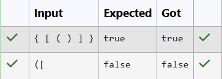

# Ex16 Check for Balanced Parentheses Using Stack
## DATE: 16-09-2026
## AIM:
To write a Java program that verifies whether the parentheses (brackets) in an input string are balanced — meaning each opening bracket (, {, [ has a corresponding and correctly ordered closing bracket ), }, ].

## Algorithm
1. Start the program.
2. Read an input string containing parentheses or brackets.
3. Create a stack to store opening brackets.
4. Traverse each character of the string:

   1. If the character is an opening bracket `(`, `{`, or `[`, push it onto the stack.
   2. If the character is a closing bracket `)`, `}`, or `]`:

      * If the stack is empty, the string is unbalanced.
      * Otherwise, pop the top element from the stack.
      * Check whether the opening bracket matches the current closing bracket.
      * If the brackets do not match, the string is unbalanced.
5. After traversing the string:

   * If the stack is empty, the string is balanced.
   * Otherwise, the string is unbalanced.
6. Display the result.
7. Stop the program.


## Program:
```
/*
Program to verify whether the parentheses (brackets) in an input string are balanced
Developed by: Elavarasan M
RegisterNumber:  212224040083
*/
```

```java
import java.util.Scanner;

public class ParenChecker {
    static class ArrayStack
    {
        private char[] data;
        private int top;
        public ArrayStack(int capacity)
        {
            data=new char[capacity];
            top=-1;
        }
        public boolean isEmpty()
        {
            return top==-1;
        }
        
        public boolean isFull()
        {
            return top==data.length-1;
        }
        public void push(char c)
        {
            if(isFull())
            {
                System.out.println("Stack overflow");
            }
            data[++top]=c;
        }
        public char pop()
        {
            if(isEmpty())
            {
                System.out.println("Stack underflow");
            }
            return data[top--];
            
            
        }
        public char peek()
        {
            if(isEmpty())
            {
                System.out.println("Stack underflow");
            }
            return data[top];
        }
    }


    public static boolean isBalanced(String expr) {
        ArrayStack st = new ArrayStack(expr.length());
        for (char ch : expr.toCharArray()) {
            if (ch == '(' || ch == '{' || ch == '[') {
                st.push(ch);
            } else if (ch == ')' || ch == '}' || ch == ']') {
                if (st.isEmpty()) return false;
                char top = st.pop();
                if ((ch == ')' && top != '(') ||
                    (ch == '}' && top != '{') ||
                    (ch == ']' && top != '[')) {
                    return false;
                }
            }
        }
        return st.isEmpty();
    }

    public static void main(String[] args) {
        Scanner sc = new Scanner(System.in);
        String expr = sc.nextLine();
        boolean ok = isBalanced(expr);
        System.out.println(ok);
        sc.close();
    }
}

```
## Output:



## Result:
Thus,the program correctly checks whether an input string has balanced parentheses using a stack.
